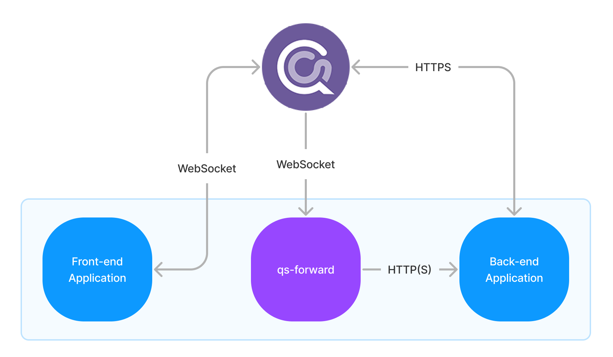

# qs-forward

Use `qs-forward` with [QuickSocket](https://quicksocket.io) to enable easy
local development and testing!

## Getting Started

Want to jump in quick?  Head over to the
[releases page](https://github.com/QuickSocket/qs-forward/releases) to download
the latest version of `qs-forward`.

Choose your preferred archive format and extract to a directory of your choice.
Don't forget to add the folder to your `$PATH`!

## What is `qs-forward`?

Developing with QuickSocket locally can be frustrating when receiving callbacks
directly over HTTPS.  The reasons for this are twofold:

- QuickSocket will not allow for plain HTTP callbacks due to security concerns.
- Accessing your local device publically requires port-forwarding and router
configuration.

Both of these make for a less-than-ideal local development experience.  For this
reason, QuickSocket now supports a new _Forward_ callback mechanism that
alleviates both painpoints described above.

## How does it work?

Typically, QuickSocket calls back to your back-end software directly over HTTPS.
This is still the preferred mechanism for production and test environments.

However, using the new _Forward_ callback mechanism, QuickSocket can instead
forward callbacks over WebSocket to `qs-forward`, which can then callback to
your back-end software over HTTP or HTTPS and complete the loop.

This allows for seamless local testing without any changes or disparity between
your local and production environments.



**NOTE**: As shown above, `qs-forward` uses a WebSocket connection to your
environment to receive callbacks - this WebSocket connection will consume
Actions like a standard WebSocket connection.  For more information on Actions
and pricing, consult
[the QuickSocket documentation](https://quicksocket.io/docs).

## Configure in QuickSocket Portal

Before using `qs-forward`, ensure your environment is configured correctly in
the _Callback_ tab.  The _Forward_ callback mechanism must be selected.

## Usage

```
qs-forward --client-id ... --client-secret ... http://localhost:8080/api
```

## TLS

By default, callbacks from `qs-forward` to your back-end application will
attempt to verify any provided certificates when using HTTPS.  If you'd like to
disable this, you can provide the `--tls-skip-verify` flag on the command-line.

## Quiet Mode

As of `qs-forward` version `0.3.0`, successful callbacks will be logged.  If
you'd like to revert to the behavior of `qs-forward` version `0.2.x` and below,
pass the `--quiet` flag on the command-line.

## Troubleshooting

If you encounter errors when first running `qs-forward`, check the following:

- Your device has an active internet connection.
- The `--client-id` and `--client-secret` you provided are correct for the
environment you are targeting.
- You have a positive number of Actions remaining in the environment you are
attempting to connect to.
- The environment is configured to use _Foward_ as the callback mechanism.
